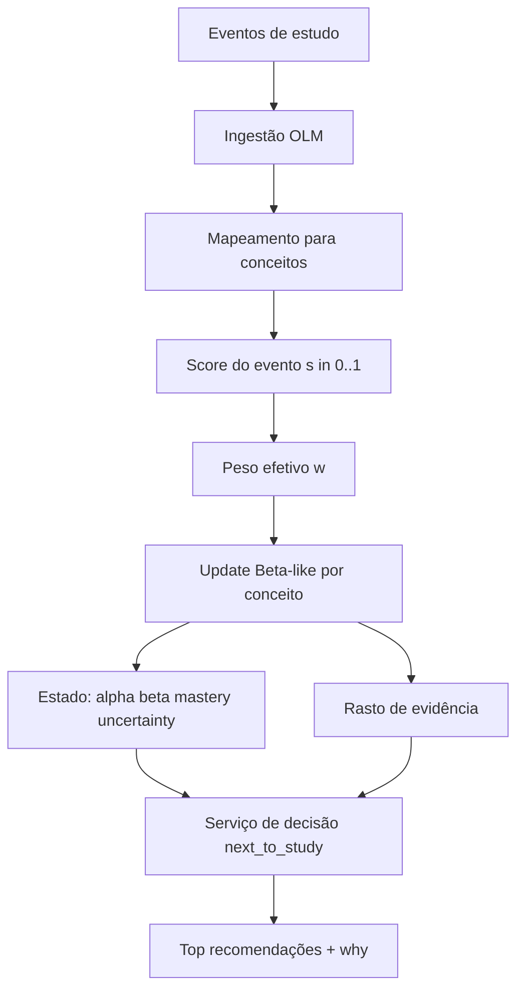

# OLM Logic Map (Project L)

Este documento descreve **a lógica completa do OLM atual**: fluxo, fórmulas, decisões, "porquê" das recomendações, sugestões e factos importantes.

## 1) Objetivo do OLM

O OLM (Open Learner Model) aqui implementado serve para:

1. Integrar eventos de estudo em formato único.
2. Manter um estado explícito por conceito (`alpha`, `beta`, `mastery`, `uncertainty`).
3. Gerar decisão "o que estudar a seguir" (`next_to_study`) com justificação.
4. Expor evidência rastreável (explicabilidade) por conceito.

## 2) Mapa de arquitetura (alto nível)



## 3) Modelo de dados (persistente desde v2)

O estado OLM é persistido em ficheiro JSON dentro do root do projeto (`.projectl-data/olm_state.json`) entre reinícios da app via `olm_save_state` / `olm_load_state`.

- `concepts`: conceitos
- `edges`: pré-requisito -> alvo
- `content_items`: itens de conteúdo
- `content_concepts`: mapeamento conteúdo -> conceito com `coverage_weight`
- `concept_state`: `alpha`, `beta`, `last_update`
- `evidence`: lista de `EvidenceChunk` por conceito
- **`config`**: parâmetros OLM persistidos (ver secção 15)

### Estado inicial por conceito

Sempre que um conceito aparece pela primeira vez:

- $\alpha = 1$
- $\beta = 1$

Isto evita divisões por zero e começa num estado neutro.

## 4) Fórmulas nucleares

## 4.1 Mastery e Uncertainty

Para cada conceito:

- $m = \dfrac{\alpha}{\alpha + \beta}$
- $u = \dfrac{\alpha\beta}{(\alpha + \beta)^2(\alpha + \beta + 1)}$

Interpretação:

- `mastery` sobe com evidência positiva.
- `uncertainty` desce quando aumenta a evidência total.

### Terminologia funcional exposta ao utilizador

Os nomes internos e símbolos matemáticos permanecem estáveis no código e na persistência, mas a interface apresenta primeiro o seu significado:

| Nome interno | Nome funcional apresentado | Significado |
|---|---|---|
| `alpha` / α | Evidência favorável ao domínio | Massa de evidência compatível com conhecimento ou desempenho correto. |
| `beta` / β | Evidência de dificuldade ou erro | Massa de evidência compatível com dificuldade, erro ou conhecimento ainda não demonstrado. |
| `mastery` / m | Domínio estimado | Estimativa atual de conhecimento, calculada a partir das duas massas de evidência. |
| `uncertainty` / u | Incerteza da estimativa | Grau de confiança do modelo na estimativa de domínio. |
| `readiness` | Prontidão estrutural | Condição para avançar, considerando o domínio e a incerteza dos pré-requisitos. |
| `score` | Prioridade de recomendação | Valor comparativo usado para ordenar os próximos conceitos. |

Os símbolos α e β só devem aparecer como referência formal entre parênteses ou no detalhe técnico, nunca como explicação principal.

## 4.2 Peso base por tipo de evento

Implementado em `event_type_weight`:

- `quiz_attempt` = 1.0
- `practice_attempt` = 0.7
- `flashcard_review` = 0.6
- `study_read` = 0.2
- `review` = 0.12
- `note_taking` = 0.08
- `self_assessment` = 0.3
- default = 0.2

## 4.3 Score do evento `s ∈ [0,1]`

Implementado em `event_score`.

### a) `quiz_attempt` e `practice_attempt`

- $s = clamp(\dfrac{correct}{total}, 0, 1)$

### b) `study_read`

- $progress = clamp(\dfrac{duration\_sec}{target\_duration\_sec}, 0, 1)$
- $s = 0.5 + 0.10 \cdot progress$

Leitura conta como sinal leve, mas parte de um baseline neutro de `0.5`.

### c) `review`

- $progress = clamp(\dfrac{duration\_sec}{target\_duration\_sec}, 0, 1)$
- $s = 0.5 + 0.15 \cdot progress$

`review` é um sinal leve-positivo para revisão rápida, também ancorado em baseline neutro.

### d) `note_taking`

- $progress = clamp(\dfrac{chars\_written}{target\_chars}, 0, 1)$
- $s = 0.5 + 0.15 \cdot progress$

`note_taking` mede produção de notas com impacto moderado, sem penalizar por omissão de evidência objetiva.

### e) `flashcard_review`

- se `rating == again` -> $s = 0$
- caso contrário -> $s = 1$
- sem rating -> $s = 0.5$

### f) `self_assessment`

- usa `payload.score` ou `payload.confidence`, com `clamp`.
- fallback: $s = 0.5$

## 4.4 Peso de confiança

Implementado em `confidence_weight`:

- Com `confidence` e `objective` presentes:

$$
w_{conf}=clamp\left(1-\lambda_{conf}\cdot|confidence-objective|,0,1\right)
$$

- Se faltar `confidence` ou `objective` -> $w_{conf}=1.0$ (fallback conservador)

## 4.5 Peso efetivo total (agrupado)

Para cada conceito afetado:

Nota de leitura: esta secção define o pipeline completo de peso (`w`) numa decomposição agrupada, mantendo o mesmo resultado final no runtime.
A secção 12 detalha a parte metacognitiva/reliability usada aqui.

- força de evidência (`w_evidence`):

$$
w_{evidence}=w_{type}\cdot w_{mapping}
$$

- confiança/fiabilidade (`r_reliability`):

$$
r_{reliability}=w_{conf}\cdot w_{meta,trust}
$$

onde `w_meta,trust` já incorpora fiabilidade metacognitiva (alignment, confiança, histórico, cap por sessão) e shrink para neutro.

- peso bruto antes de safety:

$$
w_{raw}=w_{evidence}\cdot r_{reliability}
$$

- limitador de warmup (depende do número de evidências prévias do conceito):

$$
w_{warm}=clamp\left(\frac{n+1}{warmup\_steps(event\_type)},\ 0.15,\ 1.0\right)
$$

- hard cap por tipo de evento:

$$
g_{safety}=min\left(w_{warm},\ \frac{hard\_cap(event\_type)}{w_{raw}}\right)
$$

$$
w = w_{raw}\cdot g_{safety}
$$

Aqui, `w` é o peso final aplicado no update.

Onde:

- $w_{type}$: peso por tipo de evento
- $w_{mapping}$: cobertura do conteúdo para esse conceito
- $w_{conf}$: peso de confiança
- $w_{meta,trust}$: fator metacognitivo já ajustado por fiabilidade
- $g_{safety}$: agregador de warmup + cap

Definição de confiança metacognitiva e fiabilidade: ver secções **12.3** e **12.5**.

Caps atuais (`limiter_for_event`):

- `quiz_attempt`: 0.35
- `practice_attempt`: 0.25
- `flashcard_review`: 0.20
- `self_assessment`: 0.18
- `review` / `study_read` / `note_taking`: 0.10
- default: 0.15

No score do evento, mantém-se também o shrink conservador para neutro (`safety_shrink_score`) antes do update em `delta_alpha/delta_beta`.

## 4.6 Regra de update do estado

Cada update gera um `EvidenceChunk` com:

- `event_id`
- $\Delta \alpha = w \cdot s$
- $\Delta \beta = w \cdot (1 - s)$

- $\alpha \leftarrow \alpha + \Delta\alpha$
- $\beta \leftarrow \beta + \Delta\beta$
- `delta_alpha`, `delta_beta`
- `event_type`
- `applied_weight`
- `created_at`

- `score`
  Evidência por conceito é limitada aos últimos 200 registos.

## 5) Mapeamento evento -> conceito

A função `normalize_maps` usa esta ordem:

1. Se `event.concept_ids` existir -> usa esses IDs com peso 1.0.
2. Senão, se existir `content_id` -> resolve por `content_concepts`.
3. Sem nenhuma das duas opções -> erro de ingestão.

Depois dessa resolução inicial, a ingestão filtra apenas conceitos que existem em `store.concepts` e renormaliza os pesos resultantes.

No runtime atual (v3):

- Quando o mapeamento vem de `content_id` (sem `concept_ids` explícitos), a ingestão aplica também `mapping_quality.penalty` ao bloco `w_evidence`.
- Quando o evento traz `concept_ids` explícitos, esse penalty não é aplicado (penalty = 1.0).

Regras adicionais do runtime atual:

1. Se o evento não resolver para nenhum conceito mapeado -> erro de ingestão.
2. Se resolver apenas para conceitos inexistentes -> erro de ingestão (`Event does not map to any existing concept`).
3. Só depois desta validação o evento é persistido em `study_events`.
4. Se `event_id` já existir, a ingestão é no-op e devolve `duplicate = true` sem voltar a aplicar evidência.

Isto evita sucesso silencioso com `updated_concepts = []` quando o mapeamento final é inválido.

Nota de robustez (v2):

- Pesos de mapeamento são normalizados por item/evento (somam 1.0 após deduplicação por conceito).
- `coverage_weight` inválido (não finito ou <= 0) é descartado na normalização e rejeitado no comando de mapeamento.

## 6) Lógica de recomendação (`next_to_study`)

### 6.0 Como pré-requisitos entram no grafo

No fluxo atual do editor, pré-requisitos são inferidos a partir de marcação inline no conteúdo:

- `;;;conceito;;;` -> cria/atualiza conceito inline
- `;;;conceito:prereq;;;` -> cria/atualiza `conceito`, cria/atualiza `prereq` (se não existir) e adiciona aresta `prereq -> conceito`
- `;;;conceito:pr1,pr2;;;` -> adiciona múltiplas arestas (`pr1 -> conceito`, `pr2 -> conceito`)

Todos os IDs são normalizados para o namespace do domínio no formato `<domínio>.inline.<slug>`.

Nota operacional:

- `content_concepts` e eventos automáticos de `review` usam apenas os conceitos explicitamente declarados no lado esquerdo da marcação (`conceito`), não os pré-requisitos inferidos.
- Marcação inline suporta peso opcional por conceito declarado: `;;;conceito [0.7];;;` e `;;;conceito:pr1,pr2 [0.6];;;` (intervalo válido `(0, 1]`; default `1.0`).
- Se o ficheiro não tiver nenhuma marcação inline válida, o frontend cria um conceito fallback por ficheiro (`<dominio>.file.<slug-do-ficheiro>`), mapeia `content_id -> fallback` e usa esse conceito no evento automático.
- Antes de regravar mapeamentos de um ficheiro, o frontend remove mapeamentos antigos desse `content_id` para evitar drift de `content_concepts`.

## 6.1 Readiness por pré-requisito

Para cada conceito alvo `c`:

- Se não tem ancestrais (pré-requisitos diretos ou indiretos): $R(c)=1$
- Se tem ancestrais `a` no grafo:

$$
r_a=clamp(m_a-\gamma u_a,0,1)
$$

$$
R_{min}(c)=\min_{a\in Ancestors(c)}\left(\delta^{d(a,c)}\cdot r_a\right)
$$

$$
R_{mean}(c)=\frac{1}{|Ancestors(c)|}\sum_{a\in Ancestors(c)}\left(\delta^{d(a,c)}\cdot r_a\right)
$$

$$
R(c)=\eta\cdot R_{min}(c)+(1-\eta)\cdot R_{mean}(c)
$$

Com `gamma` (simulações atuais: `0.35`) para reduzir o efeito de incerteza excessivamente agressivo.
`d(a,c)` é a distância no grafo e `delta in (0,1]` atenua o impacto de ancestrais mais distantes.
`eta` é `readiness_blend_eta` (clamped em `[0,1]`). `eta=1` recupera o comportamento estrito por mínimo; `eta=0` usa média pura.

## 6.2 Filtro de prontidão

- Existe um corte mínimo patológico: $R(c) < R_{min}$ (simulações: `0.1`) é excluído.
- O limiar `theta` continua como referência de “hard ready” para diagnóstico.
- A ordenação pode incluir conceitos abaixo de `theta` via soft-gating.

## 6.3 Score final

O runtime separa duas intenções pedagógicas:

$$
Score_{learn}(c)=R(c)^k\cdot(1-m_c)
$$

$$
Score_{review}(c)=u_c+decay_c+inconsistency_c
$$

Onde:

- `decay_c`: perda de mastery entre estado bruto e estado efetivo após decay temporal
- `inconsistency_c`: variabilidade recente dos scores de evidência no conceito

Políticas disponíveis (`ranking_policy`):

- `learn_next`: usa `Score_learn`
- `review_next`: usa `Score_review`
- `adaptive` (default): usa `learn` quando `mastery < theta`, senão `review`
- `balanced`: mantém score clássico para compatibilidade

$$
Score_{balanced}(c)=R(c)^k\cdot\Big(\lambda(1-m_c)+(1-\lambda)u_c\Big)
$$

No runtime atual, `balanced` também aplica penalização de conceito raiz (`root_penalty`) como no comportamento histórico.

## 6.4 Score Decomposition e Why (explicabilidade)

Cada item recomendado inclui um campo `score_decomposition` com os fatores individuais:

```text
Score = gate_factor × gap × (policy blend) × root_multiplier
      onde gate_factor = readiness^k
```

Campos expostos em `ScoreDecomposition`:

| Campo             | Descrição                                                           |
| ----------------- | ------------------------------------------------------------------- |
| `readiness`       | R\*(c) multi-hop com atenuação por distância                        |
| `gap`             | 1 − mastery (lacuna conceptual)                                     |
| `uncertainty`     | Variância Beta posterior                                            |
| `decay_signal`    | Redução de mastery causada por evidência antiga                     |
| `inconsistency`   | Variabilidade dos scores recentes (stddev×2 sobre últimas 8)        |
| `gate_factor`     | readiness^k (soft gate)                                             |
| `root_multiplier` | 1 − root_penalty para conceitos sem pré-requisitos                  |
| `policy_used`     | Política ativa: `learn_next`, `review_next`, `adaptive`, `balanced` |
| `weakest_prereqs` | Top-3 pré-requisitos mais fracos: [(nome, r_efetiva)]               |

As mensagens `why` são geradas a partir desta decomposição:

1. **Prereq readiness com nomes**: `"Pronto: pré-req 'Álgebra' (r=0.82); outros: 'Cálculo' (r=0.79) — readiness=0.79 ≥ limiar"` ou `"Bloqueado: pré-req 'Fundamentos' com readiness insuficiente (r=0.21)"`
2. **Lacuna conceptual**: `"Recomendado: lacuna conceptual alta (mastery=0.32, gap=0.68)"`
3. **Política ativa**: `"Política 'adaptive': learn=0.412, review=0.183"`
4. **Incerteza residual**: `"Prioridade aumentada por incerteza residual (u=0.041)"`
5. **Penalização por decay**: `"Penalização por decay: mastery efetiva reduzida em 0.12 (evidência antiga)"`
6. **Inconsistência**: `"Variabilidade de scores recentes: 0.48 — inconsistência detetada"`
7. **Soft gate**: `"Abaixo do limiar (0.50): mantido por soft-gating (k=1.60)"`
8. **Penalização de raiz**: `"Penalização de raiz aplicada: conceito sem pré-requisitos (×0.88)"`

No ranking unificado por item (`olm_next_content_to_study`), cada item também expõe:

- `mapping_quality` (0..1)
- `mapping_penalty` (multiplicador aplicado ao score)

Estes campos são mostrados no Domain Level para tornar a penalização visível ao utilizador.

## 6.5 Filtro de domínio no ranking por item

`olm_next_content_to_study` usa `domain_id` explícito em `content_items` para segmentar recomendações por domínio.

- Evita dependência exclusiva de prefixo de path.
- Mantém compatibilidade com `domain_filter` no ranking por conceito (`next_to_study`).

## 7) Porque este desenho é bom para OLM

1. **Explícito**: estado por conceito é observável (`alpha`, `beta`, `m`, `u`).
2. **Explicável**: toda mudança é rastreada no `evidence`.
3. **Controlável**: pesos e thresholds são regras claras, não caixa-preta.
4. **Extensível**: fácil adicionar novos tipos de evento, decay temporal e persistência.

## 8) Relação com os 3 níveis (root / domain / item)

Atualmente no projeto:

- **Root level**: visão agregada (streak de dias de abertura + frase motivacional no painel de níveis).
- **Domain level**: domínio ativo inferido por pasta de primeiro nível e recomendação principal.
- **Item level**: item selecionado e proxy simples de dificuldade por tamanho de conteúdo.

Importante: o OLM do backend hoje é **conceitual global** (não particionado por domínio de forma nativa).
A segmentação por domínio pode ser reforçada com:

1. Convenção de IDs (ex: `math.algebra.linear`).
2. Mapeamento `content_id -> concept_id` por domínio.
3. Filtros de recomendação por prefixo de domínio.

## 9) Sugestões concretas de evolução

1. **Persistência**: guardar estado OLM em ficheiro/DB.
2. **Domain-aware ranking**: endpoint para `next_to_study` por domínio.
3. **Item metrics reais**: acertos/erros por ficheiro em vez de proxy por tamanho. ✅ Implementado via `olm_get_content_metrics`.
4. **Decay temporal**: reduzir ligeiramente evidência antiga. ✅ Implementado no cálculo de estado efetivo quando `decay_enabled=true`.
5. **Qualidade de mapping**: aumentar uso de `content_concepts` para precisão. ✅ Eventos automáticos do editor agora registam `content_id`, criam `content_item` e mapeiam 1..N conceitos inline do conteúdo.

## 10) Factos e limites atuais

- Estado OLM é **persistido** em `.projectl-data/olm_state.json` via `olm_save_state` / `olm_load_state` (atomic write com rename).
- Eventos automáticos editor -> OLM estão ativos com `review` ao abrir ficheiro (`openFile` em `useFileSystem.jsx`).
- Guardar ficheiros de teste/quiz (`quiz-*` / `teste-*`) pode disparar check-in metacognitivo 1-4 e ingestão `self_assessment`.
- Eventos automáticos do editor só ingerem conceito(s) quando existem marcações inline no ficheiro (não promovem o ficheiro a conceito por defeito).
- Eventos automáticos do editor sempre têm mapeamento conceitual: com marcação inline usam conceitos declarados; sem marcação usam conceito fallback por ficheiro.
- O conteúdo pode declarar conceitos inline com `;;;nome do conceito;;;` e pré-requisitos com `;;;conceito:prereq;;;` (múltiplos: `;;;conceito:pr1,pr2;;;`), mapeados para IDs `<domínio>.inline.<slug>`.
- O catálogo canónico de conceitos inline fica persistido em `.projectl-data/app_state.json` na chave `inlineConceptCatalog.v1`, no formato `concept_id -> { name, requires[] }`.
- Fórmulas já implementadas com defaults robustos (fallbacks para score, confidence e readiness).
- Existe limite de 200 evidências por conceito para controlar crescimento.
- `stop_mastery` e `exclude_concepts` permitem mitigar root-bias e excluir conceitos ruidosos.
- `domain_filter` em `next_to_study` permite recomendações por domínio (prefixo de concept_id).
- Uncertainty usa a variância da Beta posterior: `alpha*beta / ((alpha+beta)^2*(alpha+beta+1))`.
- Decay temporal (modelo atual): `concept_state.alpha` e `concept_state.beta` representam o estado efetivo no instante `last_update`.
- Regra operacional:
  1. antes de ler/usar o conceito (ranking, state view), aplica-se decay de `last_update -> now`;
  2. antes de atualizar por evento, aplica-se decay de `last_update -> now`, depois soma-se `delta_alpha/delta_beta`;
  3. após update, guarda-se `last_update = now`.
- A semi-vida ativa no runtime deste modelo é `decay_half_life_days`.
- **`simulated_now` (campo runtime de `OlmConfig`, nunca serializado):** durante a simulação longitudinal (`simulate_longitudinal_cycles`), o campo `OlmConfig.simulated_now` é preenchido com o timestamp do ciclo corrente antes de cada chamada a `rank_next_to_study`/`ingest_into_store`. `decay_state_if_needed` usa `simulated_now` quando presente em vez de `Utc::now()`, evitando o colapso de mastery causado pela defasagem entre timestamps sintéticos históricos e a data real de execução.

## 11) Endpoints/comandos do OLM (Tauri)

### Existentes

- `olm_upsert_concept`
- `olm_list_concepts`
- `olm_add_edge` - rejeita self-edge, conceitos inexistentes e ciclos (`prereq -> target` quando `target` já é ancestral de `prereq`)
- `olm_list_edges`
- `olm_upsert_content_item`
- `olm_map_content_concept`
- `olm_remove_content_concept_maps` - remove todos os mapeamentos `content_id -> concept_id` para um conteúdo (retorna quantidade removida)
- `olm_ingest_event` - devolve `IngestResult { updated_concepts, duplicate }`; rejeita eventos sem conceitos válidos e não reaplica eventos duplicados
- `olm_get_state`
- `olm_get_explain`
- `olm_next_to_study` (agora com `domain_filter` e `exclude` opcionais)
- `olm_next_content_to_study` (recomendação única de item baseada em conceitos priorizados)
- `olm_get_config` / `olm_set_config` — ler/gravar parâmetros OLM
- `olm_save_state` / `olm_load_state` / `olm_reset_state` — persistência do estado
- `olm_export_json` / `olm_import_json` — exportar/importar JSON completo
- `olm_get_debug_ranking` — ranking completo com decomposição de score (debug)
- `olm_get_content_metrics` — métricas por conteúdo (`attempts`, `success_rate`, `avg_score`)

> Nota: as simulações sintéticas foram movidas para **CLI de teste** e não fazem parte da superfície final da app.

## 12) Metacognição

O OLM agora usa dados metacognitivos na ingestão real (`olm_ingest_event`) via um fator adicional:

$$
w_{pre\_meta}=w_{type}\cdot w_{mapping}\cdot w_{conf}\cdot w_{meta}
$$

Este termo é o peso **antes** dos limitadores (warmup e hard-cap) e corresponde ao mesmo bloco base descrito em **4.5**.

O peso efetivamente aplicado no update continua (exatamente como em **4.5**):

$$
w=\min\left(w_{pre\_meta}\cdot w_{warm},\ hard\_cap(event\_type)\right)
$$

Com isso, o update deixa de ser apenas "resultado bruto" e passa a considerar qualidade metacognitiva sem violar os limites de segurança do modelo.

### 12.0 Porquê (decisão de produto)

O objetivo desta camada é reduzir "cegueira" do modelo quando só existe telemetria comportamental. Dois utilizadores podem ter métricas semelhantes de interação, mas estados cognitivos muito diferentes. O check-in curto 1-4 acrescenta um sinal subjetivo mínimo para:

1. Distinguir esforço produtivo vs friccao improdutiva.
2. Capturar percecao de aprendizagem entre eventos objetivos.
3. Ajustar `w_meta` sem depender apenas de acerto/erro.
4. Melhorar priorizacao quando existe ambiguidade entre candidatos no ranking.

Princípio: usar um input simples e frequente, de baixo custo cognitivo, para enriquecer a qualidade da evidência.

### 12.1 Sinais metacognitivos usados

- `confidence`
- `perceived_score` (quando existir)
- `difficulty` / `perceived_difficulty`
- `effort` / `effort_level`
- `objective_score` (derivado de `correct/total` em eventos objetivos)

Definições operacionais (runtime em `metacognitive_signal`):

- `objective_score`:
  - se o evento tiver `correct` e `total`, então:
    $$
    objective=clamp\left(\frac{correct}{total},0,1\right)
    $$
  - caso contrário: `objective` ausente.
- `perceived`:
  - prioridade 1: `payload.perceived_score` (clamped)
  - fallback implícito em alguns ramos: `confidence`.
- `difficulty`:
  - prioridade: `difficulty`, senão `perceived_difficulty`, senão `0.5`.
- `effort`:
  - prioridade: `effort`, senão `effort_level`, senão `0.6`.

Todos estes sinais são normalizados para `[0,1]` via `clamp_01`.

### 12.2 Alinhamento metacognitivo

Exemplo principal:

$$
alignment = 1 - |objective - perceived|
$$

Implementação explícita (ordem de fallback):

1. Se existir `objective` e `perceived_score`:

$$
alignment = clamp\left(1 - |objective - perceived\_score|, 0, 1\right)
$$

1. Se existir `objective` mas não `perceived_score`:

$$
alignment = clamp\left(1 - |objective - confidence|, 0, 1\right)
$$

1. Se não existir `objective`, mas existir `perceived_score`:

$$
alignment = clamp\left(1 - |perceived\_score - confidence|, 0, 1\right)
$$

1. Sem sinais suficientes: `alignment = 0.5`.

### 12.3 Fator metacognitivo

O fator final combina dificuldade, esforço, confiança e alinhamento, com intensidade controlada por `meta_strength`:
Componentes intermediárias:

$$
difficulty\_term = 1 - 0.3\cdot\left(2\cdot|difficulty-0.5|\right)
$$

$$
effort\_term = 0.7 + 0.3\cdot effort
$$

$$
confidence\_term = 0.75 + 0.25\cdot confidence
$$

$$
alignment\_term = 0.6 + 0.4\cdot alignment
$$

$$
meta\_raw = clamp\left(difficulty\_term\cdot effort\_term\cdot confidence\_term\cdot alignment\_term, 0, 1\right)
$$

$$
w_{meta}= (1-meta\_strength) + meta\_strength\cdot meta\_raw
$$

Ou seja, `meta_raw` é o score metacognitivo composto (pré-intensidade), e `meta_strength` controla quanto esse score influencia `w_meta`.

No update real atual (`olm_ingest_event`), o backend usa o valor persistido em `config.meta_strength`.

### 12.5 Mitigação de viés metacognitivo

Para reduzir sobre-ajuste por autoavaliações subjetivas, o runtime aplica quatro salvaguardas:

1. **Fiabilidade metacognitiva** `r in [0,1]`:

- combina presença de sinal objetivo, confiança, alinhamento, histórico de evidência e cap por sessão;
- quanto menor `r`, menor o impacto metacognitivo.

1. **Shrink para neutro em baixa fiabilidade**:

$$
s' = 0.5 + (s - 0.5) \cdot (0.4 + 0.6r)
$$

onde `s` é o score bruto do evento e `s'` o score efetivo usado no update.

1. **Blending com sinal objetivo (quando existir)**:

- para eventos com evidência objetiva (`correct/total`), o score final puxa para o objetivo;
- isto limita divergência quando percepção e desempenho real entram em conflito.

1. **Cap por sessão para `self_assessment`**:

- após várias autoavaliações no mesmo dia para o mesmo conceito, o efeito metacognitivo é reduzido;
- evita inflação de influência por repetição de prompts.

Implementação de referência: `src-tauri/src/commands/olm.rs` em `metacognitive_signal`, `meta_reliability`, `meta_session_cap` e `ingest_into_store`.

### 12.4 Check-ins metacognitivos 1-4 (frontend)

Além dos sinais já presentes no payload, o frontend dispara perguntas curtas com resposta inteira `1..4` (1=muito mau/difícil, 4=muito bom/fácil) em três gatilhos:

1. Após janela temporal de sessão (check-in periódico).
2. No fim de fluxo de teste/quiz (ao guardar ficheiro `quiz-*`/`teste-*`).
3. Ao sair de um domínio e entrar noutro (transição de contexto).

Cada resposta gera um evento `self_assessment` com `payload.score` normalizado para `[0,1]`, `payload.meta_reflection_rating` e `payload.meta_trigger`, influenciando o update por `w_meta`.

## 13) Cenários sintéticos automáticos (implementado)

Foi adicionado um runner **CLI** (`src-tauri/src/bin/olm_sim.rs`) para correr automaticamente cenários imaginários sob múltiplos approaches.

Execução:

- `cd src-tauri`
- `cargo run --bin olm_sim`
- `cargo run --bin olm_sim -- --json` (output JSON)
- `cargo run --bin olm_sim -- --save` (guarda em `results.json`)
- `cargo run --bin olm_sim -- --out results.json` (guarda no ficheiro indicado)
- `cargo run --bin olm_sim -- --profile quick --seed-range 0 19` (arranque rápido com diversidade)
- `cargo run --bin olm_sim -- --profile stress --scenario-mode generated --seeds 50` (somente cenários gerados)

Parâmetros úteis para gerar muitos casos distintos rapidamente:

- `--profile quick|balanced|stress` (presets de volume/densidade)
- `--generated-scenarios N` (quantidade adicional de cenários sintéticos)
- `--graph-size N`, `--event-count N`, `--prereq-density X`, `--depth N`, `--mapping-quality X`
- `--scenario-mode mixed|canonical|hard|generated` (misto, canónicos + hard cases, apenas hard cases, ou apenas gerados)

### 13.1 Approaches atuais

O simulador inclui baselines obrigatórios + ablações explícitas. `baseline` é deliberadamente simples (`score = 1 - mastery`, sem gating, readiness avançado, incerteza, metacognição, penalização de raiz ou de mapeamento). Os parâmetros estruturais (`stop_mastery`, `min_readiness`, `soft_gate_k`, `lambda`, `readiness_threshold`) são normalizados entre as ablações de metacognição para que apenas `meta_strength` varie:

1. `random_baseline` — **shuffle seeded** por (cenário, seed): permutação verdadeiramente aleatória, reproducível; eliminada a implementação anterior baseada em hash determinístico por conceito
2. `mastery_only` — `score = 1 - mastery` (sem readiness/uncertainty, `soft_gate_k=0`)
3. `mastery_only_gated` — `score = 1 - mastery` **com readiness gating ativo** (`soft_gate_k=1.6`); ablação limpa que isola o efeito de "gap" vs "gap + readiness"
4. `uncertainty_only` — `score = uncertainty`
5. `curriculum_linear` — ordem curricular linear (primeiro não dominado)
6. `no_root_penalty` — ablação sem penalização de conceitos raiz (`root_penalty=0`)
7. `no_prereq_gating` — lógica balanced com gating desligado (`min_readiness=0`, `soft_gate_k=0`)
8. `no_mapping_penalty` — ablação sem penalização de qualidade de mapeamento
9. `no_metacognition` — ablação explícita (`meta_strength=0`); parâmetros de referência: `stop_mastery=0.85`, `soft_gate_k=1.6`, `lambda=0.7`, `readiness_threshold=0.5`
10. `metacog_balanced` — metacognição equilibrada (`meta_strength=0.6`); parâmetros idênticos a `no_metacognition`
11. `metacog_strict` — metacognição forte (`meta_strength=1.0`); parâmetros idênticos a `no_metacognition`
12. `decay_hl7` — decay ativo (`half_life_days=7`)
13. `decay_hl30` — decay ativo (`half_life_days=30`)

Também foram introduzidos `stop_mastery` operacionais (`0.85/0.90`) para impedir dominância persistente de conceitos raiz.

### 13.2 Cenários canónicos S1–S12

O modo canónico foi expandido para 12 cenários (6-10 conceitos, 10-24 eventos):

- S1 Progressão linear simples
- S2 Pré-requisito bloqueado
- S3 Conceito core com erros repetidos
- S4 Alta incerteza por pouca evidência
- S5 Overconfidence
- S6 Underconfidence
- S7 Vários conceitos fracos
- S8 Conceito avançado com pré-requisito fraco
- S9 Todos os conceitos quase dominados
- S10 Todos os conceitos desconhecidos
- S11 Conteúdo com mapeamento fraco
- S12 Conteúdo com mapeamento correcto

Nos cenários S9/S10 existem timestamps antigos (`2025-01-01`, `2025-06-01`, `2026-01-01`) para exercício de decay temporal.

O modo canónico inclui ainda H1–H6: overconfidence, underconfidence, pré-requisito fraco, revisão vs progressão, 5–8 candidatos elegíveis e sinais objetivos/subjetivos contraditórios. Estes casos usam duas fundações e seis candidatos paralelos para evitar o caso trivial de uma única resposta óbvia.

### 13.2.1 `expected_any` com readiness pedagógico

O ground truth `expected_any` usa a função `expected_any_from_true_mastery(true_mastery, edges)`.

**Prioridade 1 (preferida)** — conceitos com `true_mastery < 0.55` **e** cujos pré-requisitos diretos têm todos `true_mastery >= 0.60`. Alinha o ground truth com sequenciamento pedagogicamente correto: o sistema deve recomendar conceitos genuinamente aprendíveis agora.

**Prioridade 2 (fallback)** — qualquer conceito com `true_mastery < 0.55` quando nenhum unblocked weak existe (todos os fracos têm pelo menos um pré-requisito fraco).

**Prioridade 3 (último recurso)** — o conceito com menor `true_mastery` quando não há nenhum < 0.55 (e.g. cenário `almost_mastered`).

Tie-breaking determinístico: o sort secundário é por `concept_id` (alfabético), eliminando a não-determinismo anterior em HashMap com valores iguais (S4 `high_uncertainty`).

### 13.3 Output do simulador

Por approach, devolve:

- `hit_at_1_rate` (equivalente a `pass_rate`, mantido por compatibilidade)
- `pass_rate` documentado explicitamente como Hit@1
- `hit_at_3_rate`, `avg_mrr`, `avg_ndcg_at_3`
- `candidate_count_avg`, `tie_rate`, `easy_case_pass_rate`, `hard_case_pass_rate`
- `decision_divergence_rate`, `ranking_delta_vs_baseline`, `meta_influence_rate`
- `average_rank_of_expected`
- métricas treino/teste (`train_pass_rate`, `test_pass_rate`, `train_avg_mrr`, `test_avg_mrr`)
- deltas face a baselines: `random_baseline_delta`, `mastery_baseline_delta`, `uncertainty_baseline_delta`
- `metacognition_rank_shift` (diferença de rank médio vs `no_metacognition`)
- métricas longitudinais agregadas:
  - `avg_learning_gain`, `avg_post_test_score`, `avg_mastery_gain`
  - `avg_time_to_mastery`, `avg_bad_recommendations`, `prerequisite_violation_rate`
- resultados por cenário com ranking completo (`top_recommendations`, `rank_of_first_expected`)
- por cenário: `true_weak_concepts`, `average_rank_of_expected`, `learning_gain`, `post_test_score`, `mastery_gain`, `time_to_mastery`, `number_of_bad_recommendations`, `prerequisite_violation_rate`
- diagnóstico por cenário:
  - `candidates_before_gate` / `candidates_after_gate` (hard-ready)
  - `candidates_ranked` / `candidates_excluded_min_readiness`
  - `readiness_distribution`
  - `concept_event_counts`
  - `top_candidates` com score/readiness/mastery/uncertainty
- `best_approach_id` no relatório final
- bloco `calibration`:
  - treino S1–S8 + H1–H3 e teste S9–S12 + H4–H6;
  - cenários gerados (`G*`) entram também num split determinístico 70/30, sem sobreposição;
  - métrica de seleção: `train_pass_rate` (Hit@1) -> `train_avg_mrr` -> `hit_at_3_rate`;
  - se a diferença de treino não for material, `status=inconclusive` e nenhum `meta_strength` é recomendado por desempate.

---

Se quiseres, no próximo passo posso gerar também uma versão "Mestrado" deste mapa, já em formato de capítulo (Problema, Formalização, Algoritmo, Avaliação, Limitações e Trabalho Futuro).

## 14) CLI de simulação — flags disponíveis (v2)

```bash
cd src-tauri

# Simulação simples (determinística)
cargo run --bin olm_sim

# Output JSON
cargo run --bin olm_sim -- --json
cargo run --bin olm_sim -- --save           # guarda em results.json
cargo run --bin olm_sim -- --out path.json  # guarda em ficheiro indicado

# Multi-seed (mostra variância entre N seeds)
cargo run --bin olm_sim -- --seeds 10
cargo run --bin olm_sim -- --seed-range 0 29 --out multi_results.json

# Calibração automatizada de meta_strength + relatório versionado
cd ..
npm run calibrate:meta
```

Multi-seed agrega métricas (pass_rate, hit@3, MRR, nDCG@3) por approach sobre N execuções.  
As execuções usam seed para perturbar ligeiramente os estados dos cenários (de forma reproduzível por seed/cenário), permitindo variância real em multi-seed.

O pipeline `calibrate:meta` grava automaticamente dois artefactos em `docs/reports/`:

- `meta-strength-calibration-YYYY-MM-DD.json`
- `meta-strength-calibration-YYYY-MM-DD.md`

O payload completo por seed pode ser mantido com `--keep-raw`; por omissão é removido após agregação para evitar artefactos superiores a 100 MB.

Estes ficheiros servem de base para recomendar default de `meta_strength` em ambientes de teste/sintéticos e auditar estabilidade entre seeds.

## 15) Config OLM (parâmetros persistidos)

- `lambda` (default `0.70`): campo legado partilhado, usado como fallback quando lambdas específicos não são definidos.
- `ranking_lambda` (default `null`): lambda do score `balanced` (se ausente, usa `lambda`).
- `confidence_mismatch_lambda` (default `null`): lambda do `w_conf` em `confidence_weight` (se ausente, usa `lambda`).
- `gamma` (default `0.35`): intensidade de penalização por incerteza na readiness.
- `readiness_blend_eta` (default `0.70`): blend da readiness (`eta*min + (1-eta)*mean`).
- `readiness_distance_delta` (default `0.85`): atenuação por distância no readiness multi-hop (`delta^d`).
- `ranking_policy` (default `"adaptive"`): política de ranking (`learn_next`, `review_next`, `adaptive`, `balanced`).
- `theta` (default `0.50`): limiar para o switch do modo `adaptive` e referência de hard-ready.
- `min_readiness` (default `0.10`): readiness mínima para aparecer no ranking.
- `soft_gate_k` (default `1.60`): expoente do soft-gating no score de `learn`/`balanced`.
- `meta_strength` (default `0.60`): parâmetro persistido de metacognição aplicado no runtime de `olm_ingest_event`.
- `root_penalty` (default `0.12`): penalização para conceitos raiz no score `learn`/`balanced`.
- `stop_mastery` (default `0.85`): mastery acima do qual conceitos raiz são excluídos do ranking.
- `exclude_concepts` (default `[]`): lista de concept_ids excluídos do `next_to_study`.
- `decay_enabled` (default `false`): ativa decay temporal no cálculo de estado efetivo.
- `decay_half_life_days` (default `30`): semi-vida base em dias para o decay state-based.

### Como interpretar stop_mastery

`stop_mastery` protege contra o "root-bias": quando um conceito raiz (sem pré-requisitos) já foi bem dominado (mastery > stop_mastery), é removido das recomendações para dar lugar a conceitos mais avançados.

### Como usar exclude_concepts

Adicionar concept IDs técnicos/auxiliares ao `exclude_concepts` evita que poluam as recomendações. Continuam visíveis no `olm_get_state` e `olm_get_explain`.

## 16) Persistência — como funciona

1. `olm_save_state(path?)` — serializa o estado completo (incluindo config) para JSON, usando atomic write (escreve `.tmp` e rename).
2. `olm_load_state(path?)` — carrega o JSON e substitui o estado em memória.
3. `olm_reset_state()` — repõe o estado ao default (vazio).
4. `olm_export_json()` — devolve o JSON como string (para debug/backup manual).
5. `olm_import_json(json)` — importa JSON de string.

Na política atual da app, o frontend passa path explícito para gravar/carregar em `.projectl-data/olm_state.json` no root selecionado. Sem `path`, o backend continua a suportar fallback em AppData.

## 17) Debug Ranking

`olm_get_debug_ranking(top?, domain_filter?, exclude?)` devolve:

- `candidates`: todos os candidatos rankeados com campos adicionais:
  - `gate_factor`: fator do soft-gating (1.0 se ready, < 1.0 se não)
  - `event_count`: número de evidências já registadas para o conceito
  - `why`: lista de razões textuais para o score (enriquecida com nomes de pré-requisitos, decomposição de gap/decay/inconsistência)
- `score_decomposition`: objeto com os fatores individuais do score (`readiness`, `gap`, `uncertainty`, `decay_signal`, `inconsistency`, `gate_factor`, `root_multiplier`, `policy_used`, `weakest_prereqs`)
- `diagnostics`: `candidates_before_gate`, `candidates_after_gate`, `candidates_ranked`, `candidates_excluded_min_readiness`, `readiness_distribution`, `concept_event_counts`, `top_candidates`

Visível no OLM Panel → "Debug Ranking" no frontend.

## 18) Limitações e próximos passos

1. **Item-aware ranking**: existe recomendação única de item (`olm_next_content_to_study`) orientada por conceitos; a qualidade depende de cobertura/qualidade de `content_concepts`.
2. **Domain-aware automático**: atualmente o `domain_filter` é passado explicitamente pelo frontend; uma inferência automática pela pasta ativa pode ser integrada em `Main.jsx`.
3. **Testes de integração end-to-end**: smoke tests manuais documentados são o próximo passo (ver PROJECT_GUIDE.md).
