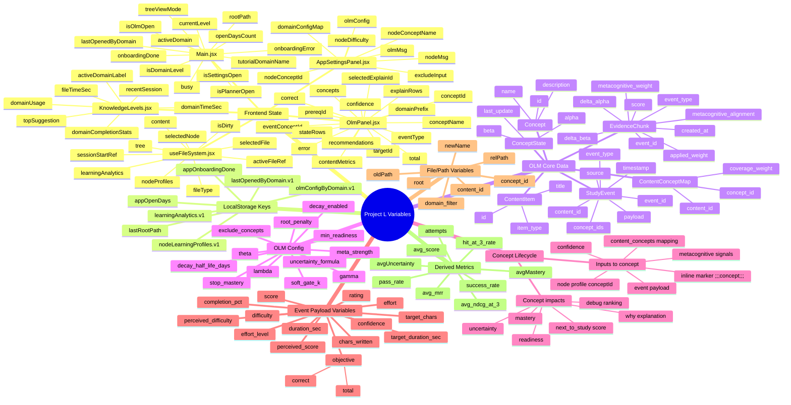

# Project Variables Mind-Map

```mermaid
mindmap
  root((Project L Variables))
    Frontend State
      Main.jsx
        rootPath
        isOlmOpen
        isPlannerOpen
        isSettingsOpen
        onboardingDone
        treeViewMode
        activeDomain
        tutorialDomainName
        busy
        onboardingError
        openDaysCount
        lastOpenedByDomain
        currentLevel
        isDomainLevel
      useFileSystem.jsx
        tree
        selectedFile
        selectedNode
        nodeProfiles
        learningAnalytics
        content
        isDirty
        fileType
        sessionStartRef
        activeFileRef
      OlmPanel.jsx
        conceptId
        conceptName
        prereqId
        targetId
        eventType
        eventConceptId
        correct
        total
        confidence
        concepts
        stateRows
        recommendations
        contentMetrics
        selectedExplainId
        explainRows
        error
        domainPrefix
      AppSettingsPanel.jsx
        olmConfig
        excludeInput
        domainConfigMap
        nodeConceptId
        nodeConceptName
        nodeDifficulty
        olmMsg
        nodeMsg
      KnowledgeLevels.jsx
        topSuggestion
        activeDomainLabel
        domainUsage
        domainTimeSec
        fileTimeSec
        recentSession
        domainCompletionStats
    LocalStorage Keys
      appOnboardingDone
      appOpenDays
      lastOpenedByDomain.v1
      lastRootPath
      nodeLearningProfiles.v1
      learningAnalytics.v1
      olmConfigByDomain.v1
    OLM Core Data
      Concept
        id
        name
        description
      ConceptState
        alpha
        beta
        last_update
      EvidenceChunk
        event_id
        delta_alpha
        delta_beta
        event_type
        score
        applied_weight
        metacognitive_weight
        metacognitive_alignment
        created_at
      StudyEvent
        event_id
        timestamp
        source
        event_type
        content_id
        concept_ids
        payload
      ContentItem
        id
        item_type
        title
      ContentConceptMap
        content_id
        concept_id
        coverage_weight
    OLM Config
      lambda
      gamma
      theta
      min_readiness
      soft_gate_k
      meta_strength
      root_penalty
      stop_mastery
      exclude_concepts
      uncertainty_formula
      decay_enabled
      decay_half_life_days
    Concept Lifecycle
      Inputs to concept
        node profile conceptId
        inline marker ;;;concept;;;
        event payload
        content_concepts mapping
        confidence
        metacognitive signals
      Concept impacts
        mastery
        uncertainty
        readiness
        next_to_study score
        why explanation
        debug ranking
    Event Payload Variables
      objective
        correct
        total
      confidence
      score
      perceived_score
      difficulty
      perceived_difficulty
      effort
      effort_level
      duration_sec
      target_duration_sec
      chars_written
      target_chars
      rating
      completion_pct
    File/Path Variables
      root
      relPath
      oldPath
      newName
      content_id
      concept_id
      domain_filter
    Derived Metrics
      avgMastery
      avgUncertainty
      success_rate
      avg_score
      attempts
      pass_rate
      hit_at_3_rate
      avg_mrr
      avg_ndcg_at_3
```
