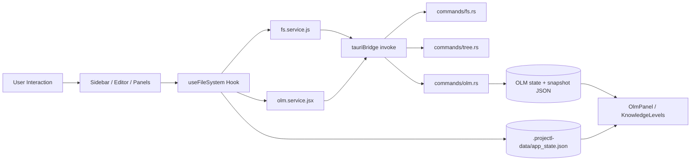

# Architecture Deep Dive

Este documento descreve a arquitetura end-to-end do Project L, cobrindo frontend (React/Vite), backend (Tauri/Rust), contratos de integração, fluxo de dados e responsabilidades por módulo.

## 1. Visão geral do sistema

- UI desktop construída em React, iniciada por Vite.
- Backend local embebido em Tauri (Rust), sem servidor remoto obrigatório para o core.
- Persistência híbrida:
- Estado OLM e estado de UI no root do projeto, na pasta oculta `.projectl-data`.
- Integrações externas opcionais:
- AnkiConnect via HTTP local (`http://127.0.0.1:8765`).

## 2. Entry points e bootstrap

### Frontend

- `src/index.jsx`: inicializa React e monta `App` no DOM.
- `src/App.jsx`: encaminha para `Main` como shell principal.
- `src/pages/Main.jsx`: orquestrador da aplicação (níveis, painéis, estado global de página).

### Backend

- `src-tauri/src/main.rs`: entrypoint ativo da app desktop Tauri.
- Regista estado partilhado `OlmState` e handlers `invoke` (FS + OLM).
- `src-tauri/src/commands/mod.rs`: agrega e re-exporta módulos de comandos (`fs`, `tree`, `olm`).

Nota: `src-tauri/src/lib.rs` contém template padrão (`greet`) e não representa o fluxo principal atualmente utilizado pelo binário desktop.

## 3. Arquitetura frontend por camadas

## 3.1 Página orquestradora

`src/pages/Main.jsx` concentra decisões de navegação e composição:

- Gestão de contexto estrutural:
- `rootPath`, `treeViewMode` (`root`/`domain`), `activeDomain`.
- Gestão de nível de experiência:
- `root` (visão geral), `domain` (painel de domínio), `item` (editor ativo).
- Gestão de painéis laterais:
- OLM (`OlmPanel`), Planner (`StudyPlannerPanel`), Settings (`AppSettingsPanel`).
- Ciclo de vida OLM:
- `loadOlmState()` no arranque.
- `saveOlmState()` periódico (60s) + `beforeunload`.

## 3.2 Estado de ficheiros e telemetria

`src/hooks/useFileSystem.jsx` é o núcleo de estado operacional do editor:

- Carregamento da árvore (`getTree`) e seleção de nós.
- Abertura/edição/gravação de ficheiros (`readFile`, `writeFile`).
- Criação/renomeação/remoção de ficheiros e pastas.
- Perfis de aprendizagem por nó (concepto, dificuldade, domínio).
- Persistência local no root oculto (`.projectl-data/app_state.json`):
- Perfis em `nodeLearningProfiles.v1`.
- Analytics em `learningAnalytics.v1`.
- Telemetria de sessão:
- Tempo por ficheiro/domínio.
- Contagem de aberturas por recurso.
- Sessões (início/fim/duração).

## 3.3 Componentes de UI e responsabilidades

- `src/components/layout/Sidebar.jsx`
- Navegação Root/Domain.
- Ações de gestão de ficheiros (novo ficheiro/pasta, mudança de pasta).
- Renderização da árvore com contexto de seleção.

- `src/components/editor/EditorContainer.jsx`
- Superfície de edição para nível `item`.
- Integra conteúdo, estado dirty e save.

- `src/components/insights/KnowledgeLevels.jsx`
- Painel contextual para níveis `root` e `domain`.
- Consome ranking unificado de item orientado por conceitos (`nextContentToStudy`).
- Mostra o item sugerido com base nos conceitos prioritários do OLM e respetivo mapeamento conteúdo-conceito.

- `src/components/olm/OlmPanel.jsx`
- UI operacional do OLM (conceitos, edges, ingestão manual, explain, recomendações).
- Faz `domainFilter` por prefixo de conceito para segmentar visualização.

- `src/components/settings/AppSettingsPanel.jsx`
- Configuração visual da app.
- Gestão de configuração OLM (get/set/reset, save/load estado).
- Configuração de perfil do nó selecionado.
- Mantém configuração OLM por domínio em `.projectl-data/app_state.json` (`olmConfigByDomain.v1`).

- `src/components/planner/StudyPlannerPanel.jsx`
- Agenda de estudo local (planos por dia em `.projectl-data/app_state.json`).
- Consome `nextToStudy` para sugestões.
- Integra com Anki via `anki.service.js`.

## 3.4 Camada de serviços frontend

- `src/services/tauriBridge.js`
- Wrapper genérico para `invoke(cmd, args)` com tratamento uniforme de erro.

- `src/services/fs.service.js`
- Contrato JS para comandos de filesystem do backend:
- `get_tree`, `read_file`, `write_file`, `create_folder`, `create_file`, `rename_file`, `delete_path`.

- `src/services/olm.service.jsx`
- Contrato JS para comandos OLM:
- conceitos/grafo, mapping conteúdo-conceito, ingestão, estado, explain, ranking, config, persistência, debug, métricas.

- `src/services/anki.service.js`
- Cliente HTTP local para AnkiConnect (`deckNames`, `findCards`).

- `src/services/rootDataStore.js`
- Persistência de estado de app no root selecionado (`.projectl-data/app_state.json`).

- `src/services/dataPolicy.js`
- Política de paths de dados internos (`.projectl-data`, `olm_state.json`).

## 4. Arquitetura backend por módulos

## 4.1 Módulo `commands/fs.rs`

Responsável por operações de ficheiros/pastas:

- Criar pasta/ficheiro.
- Renomear caminho existente.
- Eliminar ficheiro/pasta recursivamente.
- Ler e escrever ficheiros de texto.

Este módulo é stateless e recebe sempre `root + caminho relativo`.

## 4.2 Módulo `commands/tree.rs`

Responsável por projetar a árvore de ficheiros para a UI:

- Percorre diretórios recursivamente.
- Retorna `FileNode { name, path, is_dir, children }`.
- Normaliza paths relativos ao root selecionado.
- Oculta a pasta interna `.projectl-data` para não aparecer no filetree da aplicação.

## 4.3 Módulo `commands/olm.rs`

Responsável pelo motor OLM e serviços de decisão:

- Estruturas de domínio:
- conceitos, arestas de pré-requisito, conteúdo, mapeamento, eventos, estado por conceito, evidências.
- Estado em memória protegido por `Mutex` (`OlmState`).
- Ingestão de eventos com atualização de `alpha/beta`.
- Geração de vistas (`mastery`, `uncertainty`) e explainability.
- Ranking `next_to_study` com readiness e gating.
- Configuração dinâmica (`OlmConfig`) e persistência de snapshot JSON.
- Métricas por conteúdo e endpoint de debug de ranking.

Comandos expostos relevantes (registados em `src-tauri/src/main.rs`):

- Conceitos/grafo: `olm_upsert_concept`, `olm_list_concepts`, `olm_add_edge`, `olm_list_edges`.
- Conteúdo/mapeamento: `olm_upsert_content_item`, `olm_map_content_concept`.
- Estado e decisão: `olm_ingest_event`, `olm_get_state`, `olm_get_explain`, `olm_next_to_study`.
- Estado e decisão: `olm_ingest_event`, `olm_get_state`, `olm_get_explain`, `olm_next_to_study`, `olm_next_content_to_study`.
- Config/persistência: `olm_get_config`, `olm_set_config`, `olm_reset_state`, `olm_export_json`, `olm_import_json`, `olm_save_state`, `olm_load_state`.
- Diagnóstico: `olm_get_content_metrics`, `olm_get_debug_ranking`.

## 5. Fluxo de dados ponta-a-ponta

## 5.1 Fluxo de abertura de ficheiro

1. Utilizador seleciona nó na `Sidebar`.
2. `Main.handleOpenNode()` atualiza domínio/nível.
3. `useFileSystem.openFile()` lê conteúdo via `fs.service -> tauriBridge -> read_file`.
4. Hook atualiza estados de seleção/conteúdo e analytics locais.
5. Hook executa catálogo de conceitos inline (`;;;conceito;;;`) e sincroniza com OLM.
6. Hook envia evento automático `review` para `olm_ingest_event`.

Resultado: UI atualizada, telemetria local incrementada e estado OLM enriquecido.

## 5.2 Fluxo de gravação

1. Editor altera `content` e marca `isDirty`.
2. `saveFile()` escreve no backend via `write_file`.
3. Hook atualiza catálogo de conceitos inline.
4. Não há ingestão automática de evento de prática por default no save.

## 5.3 Fluxo de recomendação OLM (painel)

1. `OlmPanel.refresh()` faz `Promise.all` para conceitos, estado e recomendações.
2. `nextToStudy()` é chamado com `domainFilter` quando há domínio ativo.
3. Backend calcula ranking e devolve lista ordenada com `why`.
4. UI filtra e apresenta recomendações + métricas agregadas.

## 5.4 Fluxo de sugestões no Domain Level

1. `KnowledgeLevels` chama `nextContentToStudy()`.
2. O backend calcula conceitos prioritários com `next_to_study`.
3. O backend agrega score por item com base no mapeamento `content_concepts` (cobrindo 1 item -> 1 conceito e 1 item -> N conceitos).
4. O ranking final devolve item recomendado único por domínio/filtro.

## 6. Modelo de estado e persistência

## 6.1 Frontend (cliente)

Persistido em `.projectl-data/app_state.json` (dentro do root selecionado):

- `appOnboardingDone`: estado do onboarding por root.
- `appOpenDays`: dias de abertura por root.
- `lastOpenedByDomain.v1`: último item por domínio.
- `appSettings`: configurações visuais da app.
- `nodeLearningProfiles.v1`: perfis de aprendizagem por nó.
- `learningAnalytics.v1`: sessões, tempos e progresso.
- `olmConfigByDomain.v1`: configuração OLM por domínio.
- `appStudyPlans`: planos do calendário.

## 6.2 Backend (OLM)

- Estado em memória durante execução.
- Snapshot persistente em `.projectl-data/olm_state.json` via `olm_save_state(path)`/`olm_load_state(path)`.
- Inclui dados estruturais + estado inferido + evidências + configuração.

## 7. Contrato frontend-backend

## 7.1 Mecanismo de chamada

- Todas as chamadas backend passam por `call(cmd, args)` em `src/services/tauriBridge.js`.
- Erros de invocação são registados no console e propagados ao chamador.

## 7.2 Princípios de contrato

- Frontend não acede diretamente ao filesystem: sempre via comandos Tauri.
- OLM é a fonte de verdade para estado de aprendizagem por conceito.
- Frontend mantém estado de interação e métricas de uso de UI em ficheiro dentro do root (não em `localStorage`).

## 8. Responsabilidades por módulo (resumo executivo)

- `Main.jsx`: orquestração global e composição de painéis/níveis.
- `useFileSystem.jsx`: estado operacional do conteúdo + eventos automáticos + analytics.
- `olm.service.jsx`: gateway semântico para capacidades OLM.
- `fs.service.js`: gateway de I/O local.
- `commands/fs.rs` e `commands/tree.rs`: capacidades estruturais de ficheiro.
- `commands/olm.rs`: motor de conhecimento, decisão e explicabilidade.
- `KnowledgeLevels.jsx`: apresentação de recomendação única de item orientada por conceitos.
- `OlmPanel.jsx`: consola operacional e de inspeção do OLM.
- `AppSettingsPanel.jsx`: governação de parâmetros (UI + OLM + perfis).

## 9. Decisões arquiteturais observadas

- Backend local embebido reduz dependência de infraestrutura externa.
- Separação clara entre:
- estado inferencial (OLM, Rust),
- estado de interação (UI, `.projectl-data/app_state.json`).
- Contratos de serviço no frontend desacoplam componentes de detalhes de `invoke`.
- Segmentação por domínio é conduzida por convenção de IDs/prefixos.

## 10. Riscos técnicos e pontos de atenção

- A política atual centraliza dados no root (`.projectl-data`), o que simplifica portabilidade física, mas exige proteger contra corrupção do ficheiro agregado (`app_state.json`).
- A recomendação foi unificada em pipeline único conceito -> item; qualidade depende da cobertura/qualidade de `content_concepts`.
- `src-tauri/src/lib.rs` pode gerar ruído arquitetural por coexistir com um fluxo principal distinto.
- Parte do comportamento de domínio depende de convenções de naming (prefixos), não de tipagem forte.

## 11. Mapa de integração (alto nível)

## 12. Referências de código

- Frontend entrypoints: `src/index.jsx`, `src/App.jsx`, `src/pages/Main.jsx`
- Hook core: `src/hooks/useFileSystem.jsx`
- Services: `src/services/tauriBridge.js`, `src/services/fs.service.js`, `src/services/olm.service.jsx`, `src/services/anki.service.js`
- UI modules: `src/components/layout/Sidebar.jsx`, `src/components/olm/OlmPanel.jsx`, `src/components/insights/KnowledgeLevels.jsx`, `src/components/settings/AppSettingsPanel.jsx`, `src/components/planner/StudyPlannerPanel.jsx`
- Backend: `src-tauri/src/main.rs`, `src-tauri/src/commands/mod.rs`, `src-tauri/src/commands/fs.rs`, `src-tauri/src/commands/tree.rs`, `src-tauri/src/commands/olm.rs`
