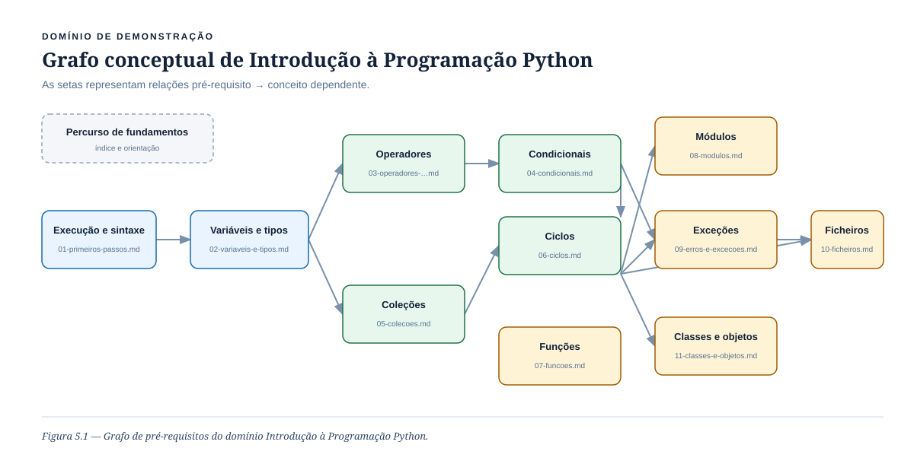
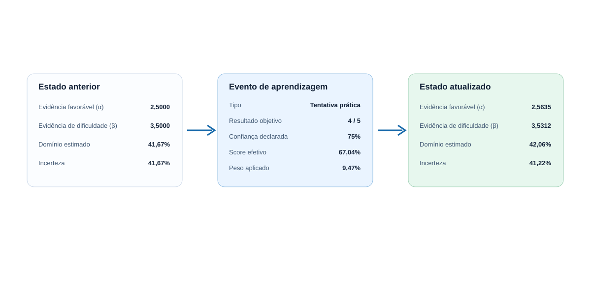
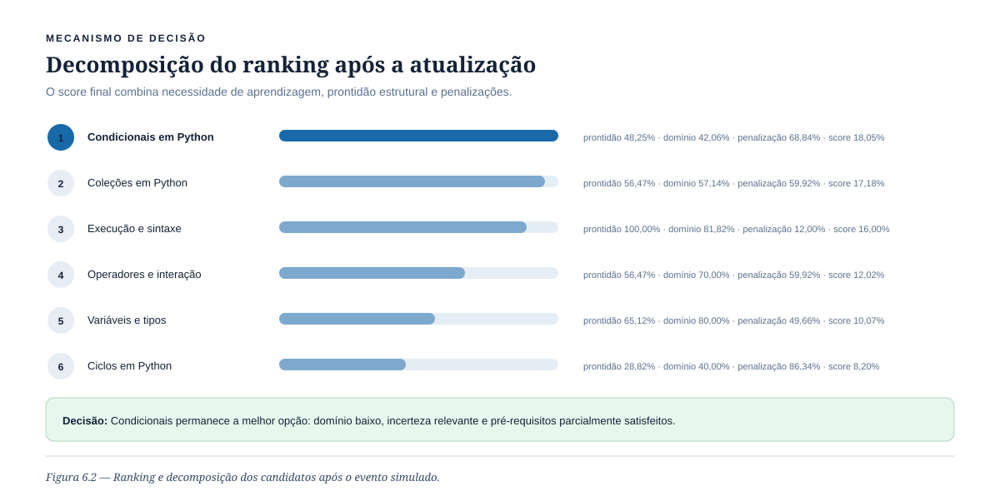

# Demonstração do OLM — Introdução à Programação Python

Este relatório apresenta um caso determinístico executado pelo mesmo motor Rust utilizado pela aplicação. Os nomes funcionais são usados no texto: **evidência favorável ao domínio** para α, **evidência de dificuldade ou erro** para β, **domínio estimado** para `mastery` e **prontidão estrutural** para `readiness`. Os símbolos matemáticos permanecem entre parênteses para permitir a correspondência com a formalização.

## 5.4 Domínio de demonstração

O domínio contém doze conceitos extraídos das marcações inline da coletânea. As relações dirigidas representam dependências pedagógicas: uma aresta `A → B` indica que A é pré-requisito de B.



*Figura 5.1 — Grafo de pré-requisitos do domínio Introdução à Programação Python.*

### Tabela 5.1 — Conceitos definidos para o domínio Introdução à Programação Python

| ID do conceito | Nome | Descrição | Pré-requisitos | Conteúdos associados |
|---|---|---|---|---|
| `percurso-de-fundamentos-de-python` | Percurso de fundamentos de Python | Visão geral e sequência recomendada da coletânea. | — | `00-indice.md` |
| `execucao-e-sintaxe-de-python` | Execução e sintaxe de Python | Execução de programas, comentários, blocos e indentação. | — | `01-primeiros-passos.md` |
| `variaveis-e-tipos-basicos-em-python` | Variáveis e tipos básicos em Python | Representação, atribuição e conversão de valores básicos. | Execução e sintaxe de Python | `02-variaveis-e-tipos.md` |
| `operadores-e-interacao-em-python` | Operadores e interação em Python | Expressões aritméticas, comparações, lógica, entrada e saída. | Variáveis e tipos básicos em Python | `03-operadores-entrada-saida.md` |
| `condicionais-em-python` | Condicionais em Python | Seleção de comportamento com `if`, `elif` e `else`. | Operadores e interação em Python | `04-condicionais.md` |
| `colecoes-em-python` | Coleções em Python | Organização de dados em listas, tuplos, dicionários e conjuntos. | Variáveis e tipos básicos em Python | `05-colecoes.md` |
| `ciclos-em-python` | Ciclos em Python | Repetição controlada com `for` e `while`. | Condicionais em Python; Coleções em Python | `06-ciclos.md` |
| `funcoes-em-python` | Funções em Python | Encapsulamento e reutilização de comportamento. | Ciclos em Python | `07-funcoes.md` |
| `modulos-em-python` | Módulos em Python | Organização e reutilização de código entre ficheiros. | Funções em Python | `08-modulos.md` |
| `excecoes-em-python` | Exceções em Python | Tratamento explícito de situações de erro. | Funções em Python; Condicionais em Python | `09-erros-e-excecoes.md` |
| `ficheiros-em-python` | Ficheiros em Python | Leitura e escrita persistente de dados. | Exceções em Python; Ciclos em Python | `10-ficheiros.md` |
| `classes-e-objetos-em-python` | Classes e objetos em Python | Modelação simples de entidades, estado e comportamento. | Funções em Python; Coleções em Python | `11-classes-e-objetos.md` |

### Tabela 5.2 — Conteúdos usados na instanciação do domínio de demonstração

| Ficheiro | Título | Conceitos cobertos | Tipo de conteúdo | Evidências possíveis |
|---|---|---|---|---|
| `00-indice.md` | Python — fundamentos | Percurso de fundamentos de Python | Nota Markdown interativa | leitura |
| `01-primeiros-passos.md` | Primeiros passos | Execução e sintaxe de Python | Nota Markdown interativa | leitura, exercício |
| `02-variaveis-e-tipos.md` | Variáveis e tipos básicos | Variáveis e tipos básicos em Python | Nota Markdown interativa | leitura, quiz, exercício |
| `03-operadores-entrada-saida.md` | Operadores, entrada e saída | Operadores e interação em Python | Nota Markdown interativa | leitura, quiz, exercício |
| `04-condicionais.md` | Decisões com condicionais | Condicionais em Python | Nota Markdown interativa | leitura, quiz, exercício |
| `05-colecoes.md` | Coleções | Coleções em Python | Nota Markdown interativa | leitura, quiz, exercício |
| `06-ciclos.md` | Ciclos | Ciclos em Python | Nota Markdown interativa | leitura, exercício |
| `07-funcoes.md` | Funções | Funções em Python | Nota Markdown interativa | leitura, exercício |
| `08-modulos.md` | Módulos e importações | Módulos em Python | Nota Markdown interativa | leitura, exercício |
| `09-erros-e-excecoes.md` | Erros e exceções | Exceções em Python | Nota Markdown interativa | leitura, quiz, exercício |
| `10-ficheiros.md` | Leitura e escrita de ficheiros | Ficheiros em Python | Nota Markdown interativa | leitura, exercício |
| `11-classes-e-objetos.md` | Classes e objetos | Classes e objetos em Python | Nota Markdown interativa | leitura, exercício |

## 6. Modelo de evidência

Foi simulada uma tentativa prática no conceito **Condicionais em Python**: quatro respostas corretas em cinco, confiança declarada de 75% e duração de 420 segundos. O desempenho objetivo é 0,80; após ponderação de fiabilidade e contração conservadora, o sinal efetivo é 0,6704. O peso aplicado é 0,0947.



*Figura 6.1 — Transformação de um evento de aprendizagem em evidência conceptual e novo estado.*

As atualizações são:

```text
evidência favorável' = evidência favorável + peso × score
evidência de dificuldade' = evidência de dificuldade + peso × (1 − score)

α' = 2,5000 + 0,0947 × 0,6704 = 2,5635
β' = 3,5000 + 0,0947 × 0,3296 = 3,5312
```

O domínio estimado passa de **41,67% para 42,06%** e a incerteza de **41,67% para 41,22%**. O efeito pequeno é intencional: o limitador de segurança impede que uma única observação altere excessivamente o perfil.

### Tabela 6.1 — Exemplo de conversão de evento de aprendizagem em atualização conceptual

| Evento | Conceito | Score | Peso | Evidência de domínio (α) antes | Evidência de dificuldade (β) antes | Evidência de domínio (α) depois | Evidência de dificuldade (β) depois | Efeito |
|---|---|---:|---:|---:|---:|---:|---:|---|
| Tentativa prática: 4/5; confiança 75%; 420 s | Condicionais em Python | 67,04% | 9,47% | 2,5000 | 3,5000 | 2,5635 | 3,5312 | Favorece o domínio, mas mantém uma atualização conservadora; uma tentativa não consolida o conceito. |

## 6. Mecanismo de decisão

Após a atualização, o motor recalcula o ranking. A penalização apresentada corresponde à redução conjunta provocada pelo *soft gate* de pré-requisitos e, quando aplicável, pela penalização de conceito raiz.



*Figura 6.2 — Ranking e decomposição dos candidatos após o evento simulado.*

### Tabela 6.2 — Exemplo de decomposição do score de recomendação

| Conceito candidato | Prontidão estrutural | Domínio estimado | Incerteza | Penalização | Score final | Decisão |
|---|---:|---:|---:|---:|---:|---|
| Condicionais em Python | 48,25% | 42,06% | 41,22% | 68,84% | 18,05% | Recomendar como próxima opção |
| Coleções em Python | 56,47% | 57,14% | 36,73% | 59,92% | 17,18% | Alternativa |
| Execução e sintaxe de Python | 100,00% | 81,82% | 14,88% | 12,00% | 16,00% | Alternativa |
| Operadores e interação em Python | 56,47% | 70,00% | 22,91% | 59,92% | 12,02% | Alternativa |
| Variáveis e tipos básicos em Python | 65,12% | 80,00% | 17,45% | 49,66% | 10,07% | Alternativa |
| Ciclos em Python | 28,82% | 40,00% | 48,00% | 86,34% | 8,20% | Alternativa |

**Condicionais** permanece em primeiro lugar porque combina domínio baixo, incerteza relevante e pré-requisitos parcialmente satisfeitos. **Ciclos** tem domínio igualmente baixo, mas é penalizado de forma mais intensa por depender simultaneamente de Condicionais e Coleções.

## Reprodução

Executar a partir de `src-tauri`:

```bash
cargo run --bin python_domain_demo -- --out ../docs/reports/python-domain-demonstration.json
```

O ficheiro JSON contém os dados completos usados nas tabelas, incluindo o evento, estado anterior, deltas, estado posterior, decomposição e justificações do ranking.
